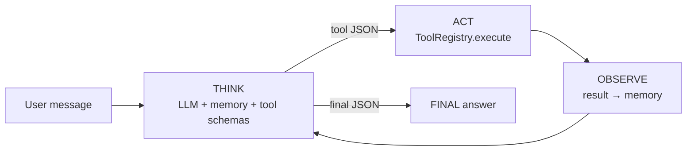

<h1 align="center">Visual Agent Harness</h1>

<p align="center">
  <strong>See</strong> how LLM agents think, call tools, and remember — in a loop you can actually watch.
</p>


<p align="center">
  <em>Education · Rapid prototyping · Visualization — not an enterprise framework.</em>
</p>

---

## Why this exists

Most agent repos bury the magic under 15 abstractions.  
**Visual Agent Harness does the opposite:** one obvious loop, three tools, a Streamlit timeline, and comments that teach.

```text
   THINK  →  ACT (tool?)  →  OBSERVE  →  THINK  →  …  →  FINAL
     ▲                         │
     └─────────────────────────┘
```

If you've ever asked *"what is the agent actually doing?"* — this repo is the answer you can run locally in two minutes.


| | |
|---|---|
| **Local-first** | Works with [Ollama](https://ollama.com) — no API key required to learn |
| **Visible loop** | Every think / tool call / observation is an event you can render |
| **Tiny core** | `harness.py` + `memory.py` + `tool_registry.py` — readable in one sitting |
| **Gorgeous UI** | Streamlit app that turns the loop into a live timeline |
| **Copy-paste examples** | Reasoning → tools → persistent memory in three scripts |

---

## Quickstart

### 1. Install

```bash
git clone https://github.com/YOUR_USER/VisualAgentHarness.git
cd VisualAgentHarness
python -m venv .venv
source .venv/bin/activate          # Windows: .venv\Scripts\activate
pip install -r requirements.txt
```

### 2. Pull a local model (Ollama)

```bash
# Install Ollama from https://ollama.com then:
ollama pull llama3.2
```

### 3a. Launch the visual UI

```bash
streamlit run ui/app.py
```

### 3b. Or run a CLI example

```bash
python examples/01_basic_reasoning.py
python examples/02_tool_use_weather.py
python examples/03_persistent_session.py
```

> **Search:** live **DuckDuckGo** by default (no key). Optional: set `TAVILY_API_KEY` for Tavily, or `VAH_SEARCH_BACKEND=mock` for the offline demo corpus.
>
> **Optional LLM:** set `OPENAI_API_KEY` to use OpenAI instead of Ollama.

---

## The loop (30-second mental model)



| Beat | What happens | Where in code |
|------|----------------|---------------|
| **THINK** | Model reads chat + tool catalog, emits JSON | `core/harness.py` |
| **ACT** | Registry runs built-in tools (math, search, wiki, …) | `core/tool_registry.py` |
| **OBSERVE** | Result appended as an observation message | `core/memory.py` |
| **FINAL** | `{"final": "..."}` stops the loop | `AgentEvent.FINAL` |

---

## Project layout

```text
VisualAgentHarness/
├── core/
│   ├── harness.py         # Agentic loop + Ollama/OpenAI backends
│   ├── memory.py          # Short-term chat + long-term RAG (pure Python)
│   ├── tool_registry.py   # Register, prompt, parse, execute tools
│   └── tracing.py         # RunTrace JSON export
├── tools/                 # calculator, search, wikipedia, remember, …
├── evals/
│   ├── cases.json         # Declarative regression cases
│   └── run.py             # Eval runner (writes traces/)
├── ui/
│   └── app.py             # Streamlit timeline visualizer
├── examples/
│   ├── 01_basic_reasoning.py
│   ├── 02_tool_use_weather.py
│   ├── 03_persistent_session.py
│   └── 04_trace_and_eval.py
└── assets/logo.png
```

---

## Tracing & evals

Every run can be saved as a JSON **trace** (steps, tools, final answer):

```bash
python examples/04_trace_and_eval.py
# → traces/demo_*.json
```

In the Streamlit UI, use **Download run trace (JSON)** after a run.

Run the regression suite (needs Ollama + a pulled model):

```bash
VAH_SEARCH_BACKEND=mock python -m evals
# or one case:
VAH_SEARCH_BACKEND=mock python -m evals --case calc_basic
```

Cases live in `evals/cases.json` — add your own prompts and checks (`must_call_tools`, `answer_contains`, …).

---

## Minimal code sample

```python
from core import AgentHarness
from tools import register_builtin_tools

agent = AgentHarness(backend="ollama", model="llama3.2")
register_builtin_tools(agent.tools)
agent._ensure_system_message()

for step in agent.stream("What is (17 * 19) + 3? Use the calculator."):
    print(step.event.value, step.tool_name or "", step.content[:80])

print("→", agent.last_answer)
```

Subscribe to events for your own UI, tests, or notebooks — same contract the Streamlit app uses.

---

## Built-in tools

| Tool | Role | Notes |
|------|------|--------|
| `calculator` | Precise math | AST whitelist of `+ - * / // % **` |
| `search` | Facts / weather / docs | **DuckDuckGo** by default; Tavily if `TAVILY_API_KEY`; mock if `VAH_SEARCH_BACKEND=mock` |
| `python_exec` | Scratchpad reasoning | Restricted builtins; **educational sandbox only** |
| `wikipedia` | Encyclopedia lookup | Public Wikipedia API — no key |
| `datetime_now` | Current date/time | IANA timezones (`UTC`, `Europe/Istanbul`, …) |
| `http_get` | Fetch a URL | Size/time capped; http(s) only |
| `unit_convert` | Unit conversion | Length, mass, volume, temperature |

Register your own in a few lines:

```python
from core import ToolRegistry
from core.tool_registry import Tool

registry = ToolRegistry()
registry.register(Tool(
    name="echo",
    description="Echo text back",
    parameters={"type": "object", "properties": {"text": {"type": "string"}}, "required": ["text"]},
    func=lambda text: text,
))
```

---

## Memory model

- **Short-term** — ordered chat turns (system / user / assistant / observation), auto-trimmed  
- **Long-term** — bag-of-words cosine RAG (no vector DB, no extra deps)  
- **Persistence** — `memory.save()` / `memory.load()` to JSON for session demos  

Enough to *teach* retrieval-augmented agents. Swap in real embeddings when you outgrow it.

---

## Stack

| Layer | Choice | Why |
|-------|--------|-----|
| Language | Python 3.10+ | Universal for AI learners |
| Local LLM | `ollama` | Free, private, clone-and-run |
| Cloud LLM | `openai` (optional) | One flag to switch backends |
| UI | `streamlit` | Fastest path to an interactive timeline |
| License | MIT | Star, fork, teach, remix |

---

## What this is / isn't

| ✅ Is | ❌ Isn't |
|-------|----------|
| A microscope for agent loops | A production orchestrator |
| A teaching + prototyping kit | A multi-agent enterprise platform |
| Readable, commented Python | A replacement for LangGraph / AutoGen |
| Traces + a small eval suite | Native provider tool-calling APIs |

---

## Contributing

Ideas that make the loop **clearer** or the UI **more visual** win.  
Open a [feature request](.github/ISSUE_TEMPLATE/feature_request.md) or [bug report](.github/ISSUE_TEMPLATE/bug_report.md).

```bash
# Dev loop
pip install -r requirements.txt
streamlit run ui/app.py
```

---

## License

[MIT](LICENSE) — use it in courses, blog posts, hackathons, and side projects.

---

<p align="center">
  If this helped you <strong>see</strong> agents for the first time, give it a ⭐ — it helps other learners find it.
</p>
